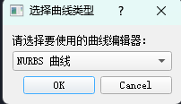
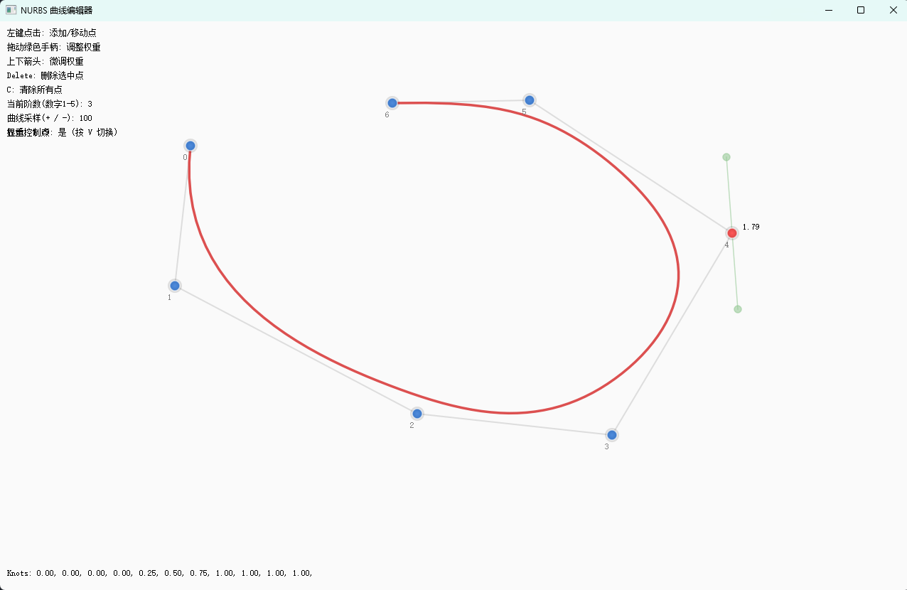
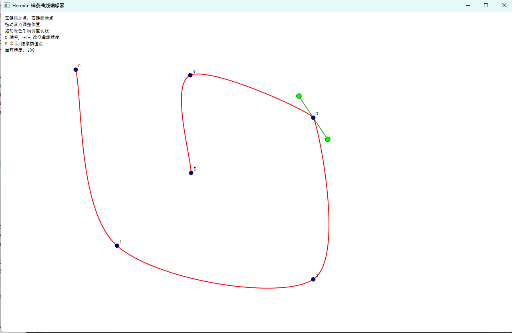

# Qt NURBS & Hermite 三次样条曲线编辑器

一个基于 Qt 的交互式二维曲线可视化与编辑工具，支持构建、编辑和实时渲染 NURBS 和 Hermite 曲线。

---

## 特性 Features

### Hermite 三次样条曲线编辑器

- 支持插值点的添加、拖动、删除
- 支持切线的手动控制与自动估算
- 实时调节采样精度（+ / -）
- 可选显示插值点编号与控制手柄
- 清除节点（C）与可视性切换（V）快捷键支持

### NURBS 曲线编辑器

- 支持控制点的添加、移动、删除
- 可视化曲线节点权重手柄（支持拖动和键盘微调）
- 权重微调支持（上下方向键）
- 支持设置阶数（1~5）与采样精度
- 实时显示 Knot 向量
- 控制点显示开关（V 键）
- 清除节点（C）与可视性切换（V）快捷键支持

---

## 快捷键说明

| 键盘操作 | 功能说明                 |
|----------|--------------------------|
| `左键单击` | 选择/拖动点              |
| `左键双击` | 添加点（插值点或控制点） |
| `右键单击` | 删除点                  |
| `C`       | 清空所有点              |
| `V`       | 显示/隐藏控制点/插值点   |
| `+ / -`   | 增加/减少采样精度        |
| `↑ / ↓`   | 增加/减少选中点权重      |
| `1 ~ 5`   | 更改 NURBS 曲线阶数      |
| `Delete`  | 删除选中点              |

---

## 构建与运行

### 环境要求

- **Qt 5**
- **C++11 或更高标准**
- 可使用 Qt Creator 或命令行构建

### 使用 Qt Creator 构建

1. 打开 `.pro` 工程文件
2. 构建并运行

/project-root/
├── HermiteEditor.h / .cpp    # Hermite 曲线编辑器实现
├── NurbsEditor.h / .cpp      # NURBS 曲线编辑器实现
├── main.cpp                  # 启动入口
├── mainwindow.ui / .cpp      # UI 界面集成（如使用 Qt Designer）
├── resources.qrc             # （可选）图标/资源管理
├── README.md                 # 当前文档
└── DesignWork.pro                     # Qt 项目文件

## 截图

## 参考课程

GAMES102-几何建模与处理-刘利刚-USTC
